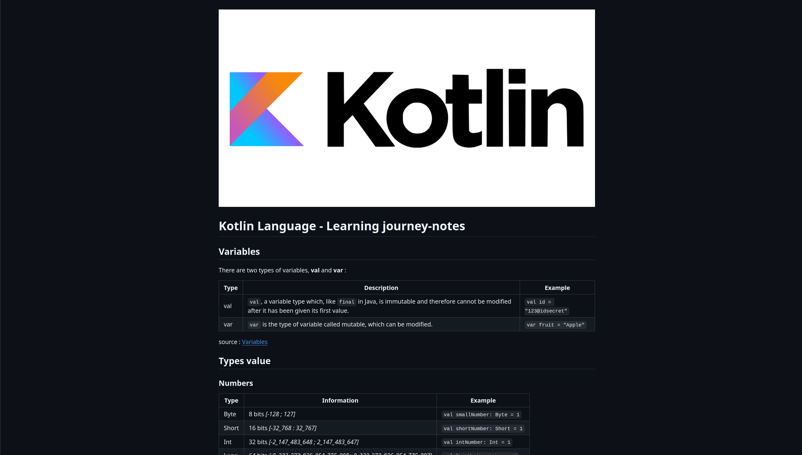

# 📈 app-from-scratch-tradeView

> **My Personal Journey:** Building a Finance & TradingView-inspired application from A to Z.

---

## 🪜 Step
### [Phase 1] - 🔗 [Learning Kotlin Basics](https://kotlinlang.org/docs/getting-started.html) (kotlinkOfficalSite)

---

### 🔗 - Kotlin MarkDown Note (add link to the KotlinMarkDown file) 

## ⚖️ License

This project is licensed under the **GNU GPL v3**. See the [LICENSE](LICENSE) file for details. 
*Note: This repository is a personal learning pathway. All rights reserved regarding original architectural notes.*
